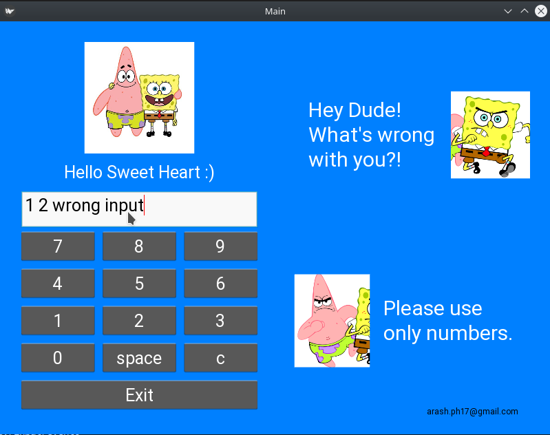
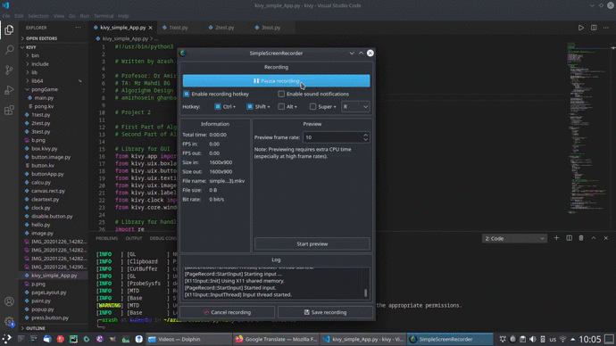

# [Kivy_Simple_App](https://github.com/arashph17/kivy_simple_app)
## Welcome :sunglasses:



## In this section you can see the preview of the App
Also in this directory their is 'demo.mkv' that you can see this content in the video format.


### Allright, it's time to explanation :dizzy_face:

In this bunch of code, we want to divide a list of Cards with Specific value between bob and potrick in the fairest way.

The Algorithm Part of that is too simple :flushed: :grin: You can see and Understand.

The GUI Part of that written with [kivy](https://kivy.org/#home) and it's difficult to explain, you can read that and if you could understand, then good for you :wink: :sunglasses:
<br />
### How to Use:
#### Requirements
Just kivy
```bash
pip3 install kivy
```
#### [GNU/Linux Distribution](https://www.gnu.org/gnu/linux-and-gnu.en.html):

```
python3 main.py
or
./main.py
```

#### [Windows](https://stallman.org/microsoft.html) God damn window :poker: by the way
```
python3 main.py
```

PS: we could put the file in the diffrent directory for more arrangement, but running that in the Unix-like system and widows was getting hard.
<br />
<br />

And in the end, this code was my project in the Algorithm Design Lesson.

Thanks to: <br />
- Dr Fatemeh Amiri (Professor) <br />
- Mr Mahdi BG (TA)
 
<br />
<br />

### TODO
- build APK (android version) with [buildozer](https://buildozer.readthedocs.io/en/latest/) or [python4android](https://python-for-android.readthedocs.io/en/latest/) or ...
<br />
<br />

Bye Bye :worried: :hand:

<br />
<br />
